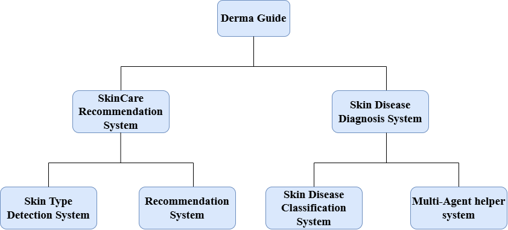

# 🧠 Smart Skin Health Assistant – AI System for Personalized Skincare Recommendations & Skin Disease Diagnosis "DermaGuide"

## 📌 Overview

This project presents a **fully integrated AI-powered Skin Health System** that performs:
- 🔍 **Automated skin disease diagnosis**
- 💡 **Personalized skincare product recommendations**
- 🤖 **Intelligent multi-agent assistance** for disease information and hospital search

It combines advanced Deep Learning (ViTs & CNNs), classical ML, NLP, Recommendation Systems, and LLM-powered agents into one comprehensive platform.  
All components were built under computational constraints (16GB GPU, 13GB RAM), proving efficiency, scalability, and real-world feasibility.

The Overall Project Structure is shown below: 

---

## 🚀 Main Features

### 1. Skin Disease Diagnosis System

**Model:** Fine-tuned [Swin Transformer (ViT)](https://arxiv.org/abs/2103.14030)  
**Dataset:** [ISIC 2019](https://challenge2019.isic-archive.com/) + selected classes from HAM10000

#### Pipeline:
- Metadata & image preprocessing, label encoding, and merging
- Advanced class balancing via **targeted data augmentation** and **minority class boosting** from HAM10000
- Training with early stopping and validation on a stratified split
- Training a finetuned SWIN ViT on the images data: **86.96% accuracy**, **92.48% balanced accuracy**
- **Feature extraction (1536-dim)** from Swin ViT’s average pooling layer
- Fusion with patient metadata (age, gender, anatomical site)
- Tabular classifiers trained on combined features:
  - 🏆 Random Forest (Optuna-tuned): **87.27% accuracy**
  - XGBoost (RandomSearch-tuned): **87.13% accuracy**

#### Key Results:
- Significant improvement across all disease classes
- Balanced accuracy > test accuracy ⇒ strong performance on minority classes
- The full system pipeline is shown in the diagram below:

---

### 🤖 2. Multi-Agent Assistance System

**Framework:** [LangGraph](https://github.com/langchain-ai/langgraph) + [OpenRouter API](https://openrouter.ai/)  
**LLM used:** GPT-3.5 Turbo (0.2 temperature)

#### Purpose:
To **enhance the patient experience** post-diagnosis by:
- Explaining the disease in layman’s terms
- Suggesting the **top hospitals or dermatology clinics** in the patient’s country (with their address and contact info)

#### Agents:
- `DescribeDiseaseAgent`: Outputs a brief description about the diagnosed disease, its symptoms, causes, and treatments
- `FindHospitalAgent`: Searches the web and LLMs for updated hospitals' contact info

#### Test Cases:
- Performed on all 8 disease classes and multiple countries (Egypt, UK, USA, France, Germany)
- System showed high factual accuracy, up-to-date data, and reliable performance

---

### 🧴 3. Personalized Skincare Product Recommendation System

**Objective:** Recommend skincare products tailored to the user’s **skin type, allergies, preferences, and budget**.
**Datasets:** A Skin type dataset from  [Robo flow](https://roboflow.com/) website was used for the skin type detection, and the [Sephora Products and Skincare Reviews](https://www.kaggle.com/datasets/nadyinky/sephora-products-and-skincare-reviews) from Kaggle was used for the skincare Recommendation.

#### 👇 Workflow:
- Use **BERT-based sentiment analysis** on the product reviews to generate sentiment scores from these reviews.
- Detect user’s **skin type** from the uploaded image using the fine-tuned **VGG16** model (That was trained using 5-fold Cross Validation)
- Apply multi-stage filtering:
  - Filter by product type, allergy ingredients (e.g., “pentylene glycol”), ratings and price
  - Applying User-based Collaborative filtering using cosine similarity(to find the products the users who have similar skin types liked).
  - Applying Content-based Collaborative filtering using cosine similarity (to find products similar to what the user likes).
  - Combine the results using **hybrid intersection** of content- and collaborative-based filters.

#### ✅ Outcome:
- Precise and personalized recommendations with both **contextual** and **behavioral** relevance
- Has been tested successfully
- Final result example: Out of 20 products, **2 highly suitable products** were returned for a dry-skinned, allergic, $50-budget user
- The full system pipeline is shown in the diagram below:

---

## 📊 The main Contributions

### 🔍 Identified Research Gaps:
- Most of the prior works focused on a single aspect of recommendation (skin type, collaborative filtering, etc.)
- Disease classification models rarely leveraged patient metadata
- Diagnosis systems typically gave disease names only—no context or support afterward

### 🌟 Contributions:
1. **End-to-End System**: This system combines:
   - Vision + metadata for the skin disease diagnosis
   - Multi-agent LLM system for personalized assistance instead of just providing the disease name as output
   - Integrated Skin Care Recommender System:The skincare recommendation system went beyond the previous works by combining multible recommendation techniques in 1 system to provide a stronger and relevant recommendations for the users.
2. **Advanced Fine-tuning**: Efficiently fine-tuned SWIN ViT under limited resources
3. **Metadata Fusion**: Proved that the patient meta features can boost the skin disease diagnostic accuracy
4. **Smart Assistive Agents**: Integrated LLMs via LangGraph to provide a real-time, structured medical assistance

---

## Tech Stack

| Component                     | Technologies Used                                    |
|-------------------------------|------------------------------------------------------|
| Disease Diagnosis             | PyTorch, Swin ViT, Random Forest, XGBoost, Optuna    |
| Recommendation System         | VGG16, BERT, Cosine Similarity, Pandas, Scikit-learn |
| Multi-Agent Assistant         | LangGraph, GPT-3.5-Turbo, OpenRouter API             |
| Metadata Processing           | Pandas, LabelEncoder, OneHotEncoder                  |
| Visualization & Reporting     | Plotly, Matplotlib, Seaborn, Classification Reports  |

---

## Computational Resources

| Component                 | Environment                | Resources Used              |
|---------------------------|----------------------------|-----------------------------|
| Skin Type Detection (VGG) | Google Colab               | NVIDIA T4 GPU               |
| Disease Classifier (ViT)  | Kaggle Notebooks           | NVIDIA Tesla P100, 16GB RAM |
| ML Classifiers (RF/XGB)   | Kaggle CPU + GPU           | 13 GB RAM, CPU              |
| Multi-Agent System        | Kaggle CPU Notebook        | 13 GB RAM                   |

---

## 📫 Contact

For questions, or improvements, feel free to reach out:

**Saba Mohamed**  
Fresh Graduate from the British University in Egypt (BUE).

📧 Email: saba.mohamed.abdeltawab@gmail.com

🌍 LinkedIn: [linkedin.com/in/saba-mohamed-552a102b2](https://www.linkedin.com/in/saba-mohamed-552a102b2/)

---

> 💡 *“An intelligent system should not only predict a disease or recommend a product, it should assist, explain, and adapt to its user.”*  
> — *Project Philosophy*
